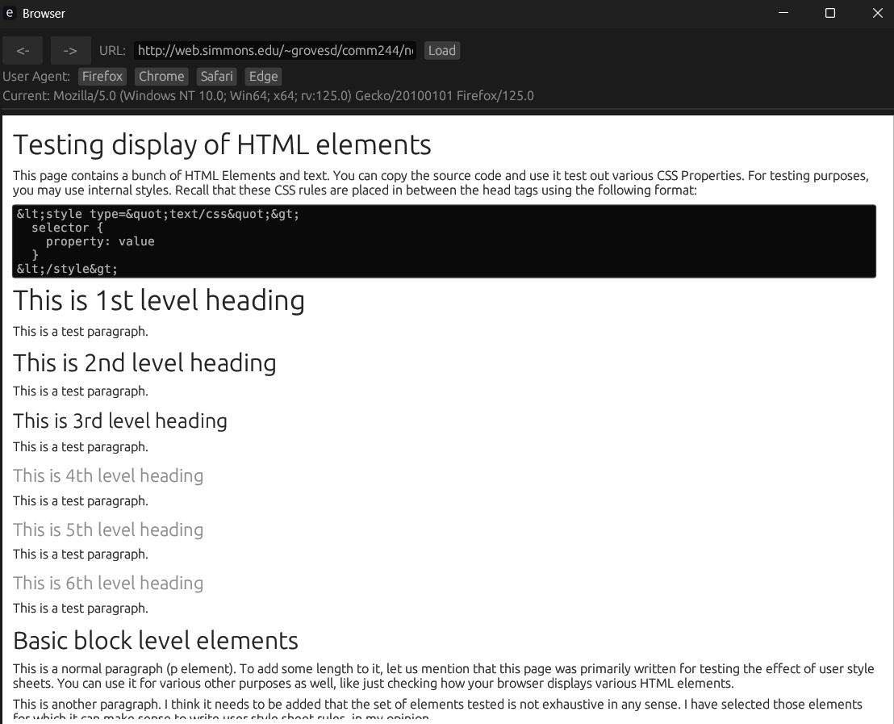

# egui Browser

A lightweight HTML browser built with Rust and egui.

## Screenshot



## Features

- Basic HTML rendering
- Simple navigation (forward/back)
- URL input and loading
- Configurable user agent (Firefox, Chrome, Safari, Edge)
- Raw HTML source view toggle
- White background for web content with dark UI elements


## Building from Source

### Prerequisites

- [Rust](https://www.rust-lang.org/tools/install) (stable)
- Cargo (comes with Rust)

### Build Steps

Clone the repository and build:

```bash
git clone [your-repository-url]
cd egui_browser
cargo build --release
```

The executable will be available at:
- Windows: `target/release/egui_browser.exe`
- Linux/macOS: `target/release/egui_browser`

## Running

```bash
# From the project directory
cargo run --release

# Or run the executable directly
./target/release/egui_browser
```

## Usage

1. Enter a URL in the address bar
2. Press Enter or click "Load" to navigate to the URL
3. Use back/forward buttons to navigate through history
4. Toggle "Show Source" to view raw HTML
5. Select different user agents via the buttons

## Project Structure

- `src/main.rs` - Entry point
- `src/app.rs` - Main application logic
- `src/html_renderer.rs` - HTML rendering engine
- `src/style.rs` - CSS-like styling for HTML elements
- `src/ui_components.rs` - UI elements and display components

## Dependencies

- [egui](https://github.com/emilk/egui) - Pure Rust immediate mode GUI
- [eframe](https://github.com/emilk/egui/tree/master/crates/eframe) - egui framework
- [ehttp](https://github.com/emilk/ehttp) - HTTP client
- [html-parser](https://crates.io/crates/html-parser) - HTML parsing
- [poll-promise](https://crates.io/crates/poll-promise) - Promises for async operations

## License

MIT License
